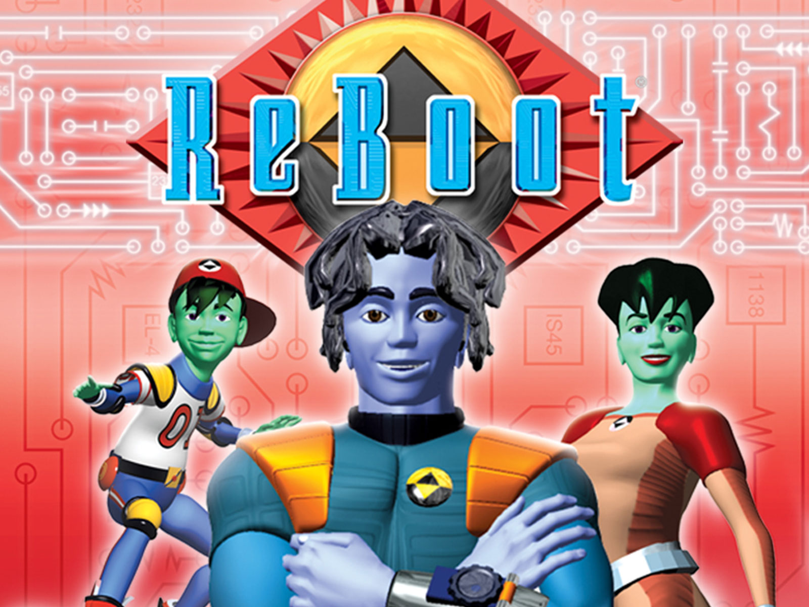

<h2> Hard & Soft</h2>
I'm going soft, I've always been hard. Hard as steel, now my wares are soft. I'm talking about hardware of course. My interest has always been in hardware. I've never dabbled in software, but the more I learn about it, the more I don't want to learn about it. Hardware is easy, you just plug and play with a bit of common sense. Software, however, you need to use your brain. It requires a lot of thinking, researching, praying, frustrating, dying, resurrecting, dying again, restarting, pretty much everything. But, since I learned about software, I now know hardware is nothing but a shell without the software. Softwares are the brains of the hardwares. It instructs them how to perform their tasks. So, now my interest has shifted to software, like a soft reboot.

<h2> I Hope </h2>
In the future, I hope to understand how software interacts with their respective hardware. I hope to experience more of building software to make hardware do its purpose like my FPGA project. The process of making software work is extremely frustrating, I hope it gets less stressful and is easier to cope with the more experience I gain. Lastly, I just hope I get to be more confidence in my work. Frustration comes from doubts, I hope doubting myself will be a thing of the past.

<h2> End of the Beginning </h2>
So, far my knowledge of software is as deep as a puddle. But that's how you begin to make a pool, well in my case, bathtub size is enough, but that's not the point. My software engineering era just started. I can't expect myself to just know everything, I have to work for it, like playing an MMORPG game, grinding and repetition will gain experience, no matter how boring and repetitive it is. So, my interest in software engineering might not be high, maybe just below mid, but that won't stop me from learning and gaining the skills necessary to move forward. 

