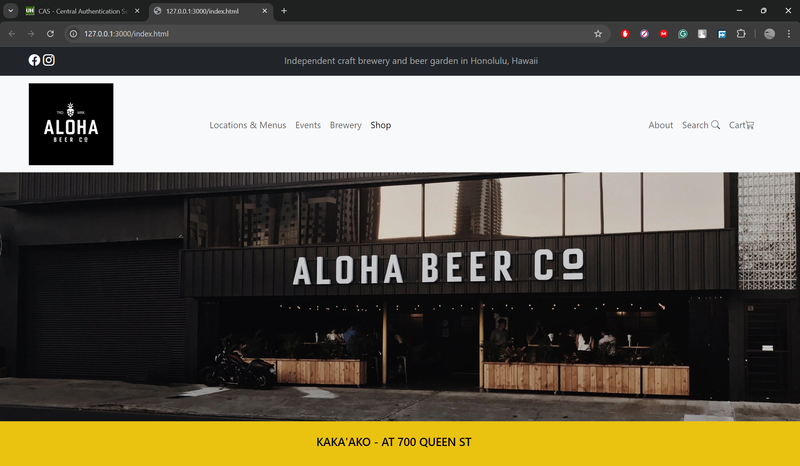

## UI Framework
Can help make life simpler if you are willing to learn. UI Frameworks provides many pre-built components needed to make a website such as icons, buttons, dropdowns, etc. They are prebuilt, but you have to learn how to implement them. Raw HTML and CSS do not have anything prebuilt, so you would have to build the icons yourself and implement them to your liking. That's what makes UI Frameworks worth learning, you don't have to create everything yourself, but only know how to implement them. So, UI Frameworks can be a dream come true for website creation, when you learn to implement them.
## Boostrap5
This framework adds many icons, to the raw HTML and CSS. A website's goal is to catch the eye of a visitor and be organized so that it is easy to navigate through. UI frameworks such as Bootstrap 5 do just that. It is up to the software engineer to organize how it is used. So, the full benefits of UI frameworks depend on the software engineer's ability to use them wisely. 
## MY Experience
So far, UI Framework has been very frustrating to me, but so very well useful. I still find it difficult to text overlay and move them around. The Bootstrap frameworks really help make the websites feel more alive and organized. It makes it feel more welcoming rather than overwhelming like looking at the source codes. So, I still have a lot of learning to do but the end results of my work is worth the hassle.
#AI
I did not use AI writing this essay.
