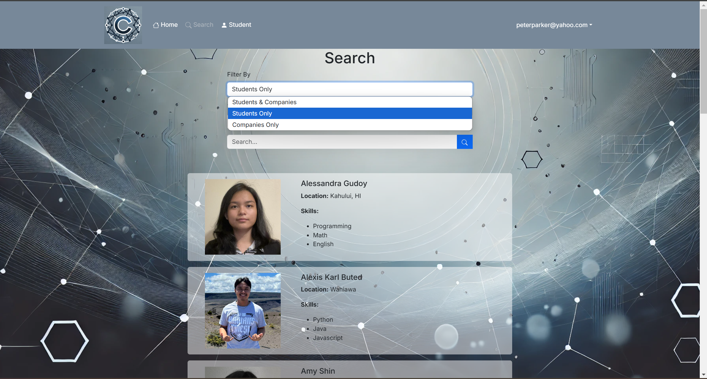
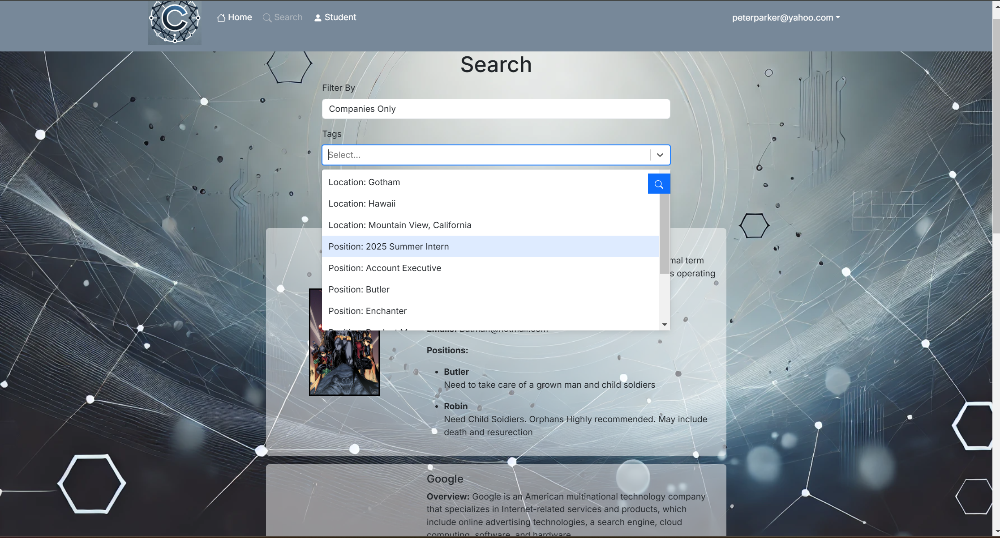
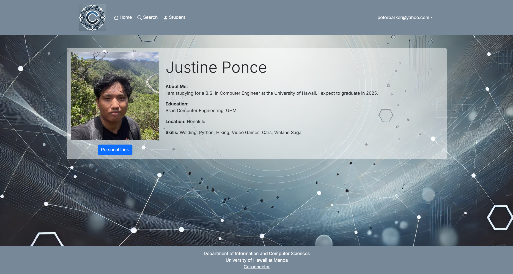
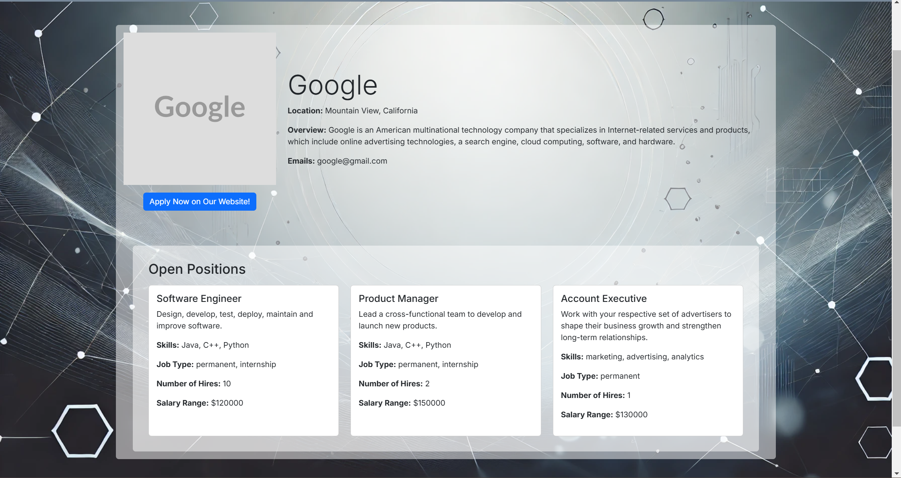
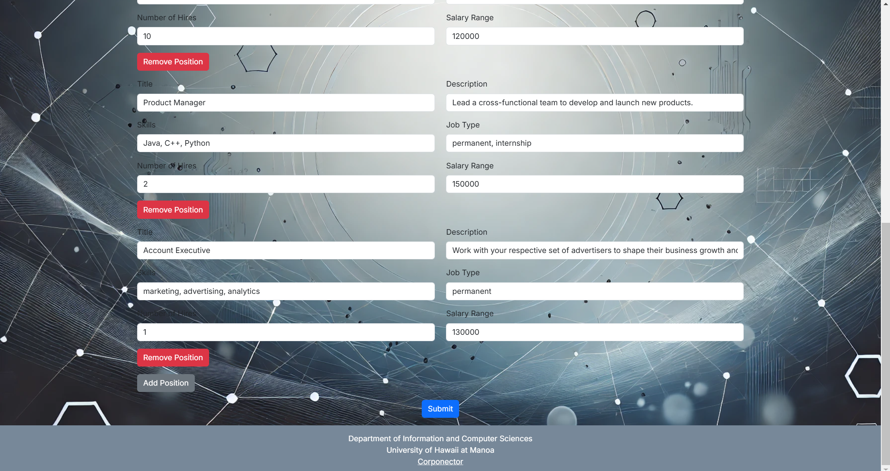
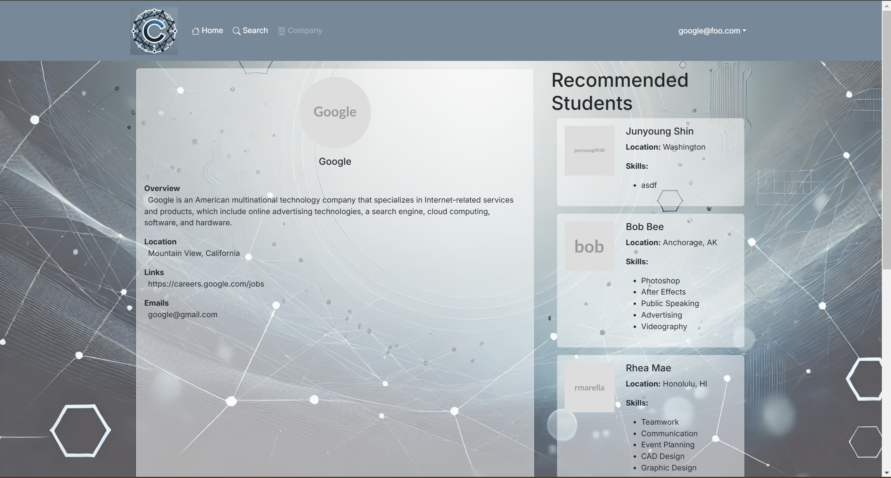
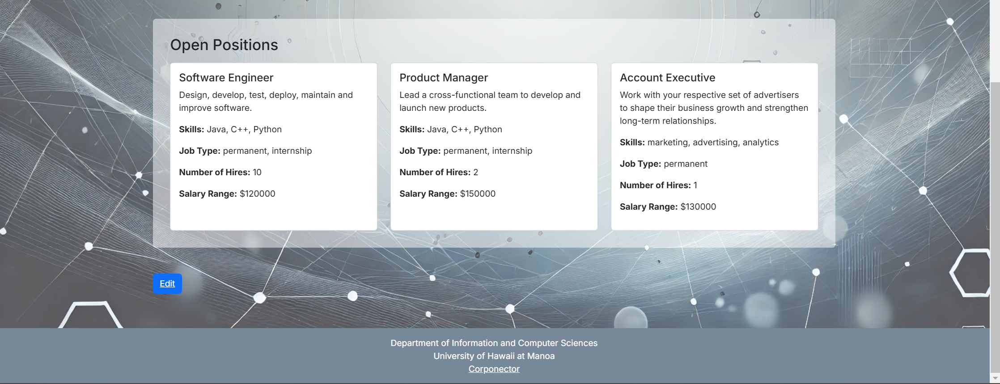
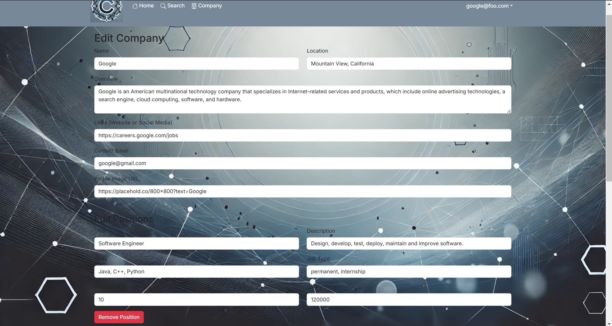

<h2> Project Information </h2> 
The primary goals of this project are to enhance Job and Internship Visibility and make it easy for students to explore a wide range of opportunities from numerous companies.
It will also streamline connections so that it allow companies to post details about potential positions and recruit students with the necessary skills and interests.
It will match skills and interests. It enables students to create profiles with their skills and career preferences, while companies can specify the skills they look for in candidates.
It provides support admin oversight. The administrators will have the ability to monitor site content, add new skill or location categories, and manage the platform. At the same time, students can create profiles on the site with their interests. The site can match students to employers and vice-versa.

<h2>My Contribution </h2> 
I pretty much did everything on the search page.

It can filter Students and Companies. The tags include Location, Skills, and Positions. The student and company cards include some information about their profile. You can also search for student and companies by their name.

Clicking on the student card will load the student profile page which includes the student's basic information and a link to their personal portfolio.

Clicking the company card will load the company profile page which includes company basic information and open positions for the company along with a link to their website.

I also added the positions when creating a company profile. This allows companies to create as many open positions as they want.

Lastly, I created the company page. This includes company basic information, open positions, recommended student cards, and the edit button where you can edit profile information or add and remove positions.

<h2> My Experiences </h2>
Overall, I was surprised that it was actually quite fun making this website. It wasn't as stressful as I imagined. It was still stressful but when I got it right, the positive nullified the negative completely. I really don't know, it was just fun creating this website. When I got it working, it was the most satisfying feeling I had. In conclusion, even if I had to do most of the work, I don't feel mad or anything, it's just very satisfying to finish it. 

<a href="https://corponector.github.io/">Project Homepage</a>

<a href="https://corponector.vercel.app/">Project Website (Corponector)</a>

<a href="https://github.com/corponector/sourceCode">Website Source Code!</a>
