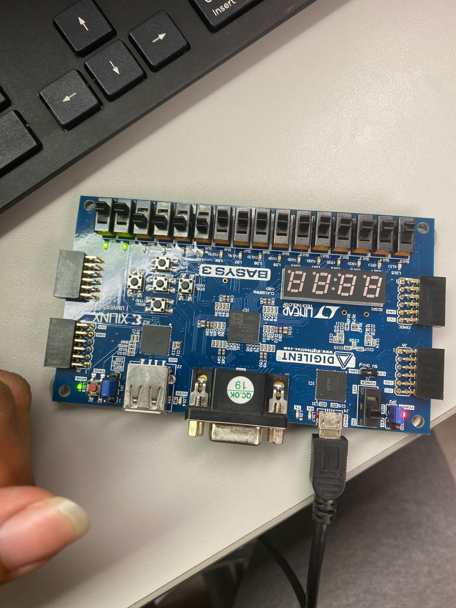

<h2> Project Information  </h2>
The purpose of this project was to learn a web-pack tool software called Xilinx Vivado and FPGA or Field Programmable Gate Array board. Xilinx Vivado will be used to program the FPGA board. The tool will contain SystemVerilog codes which program the FPGA board to switch the LED lights. The SystemVerilog code will follow an ALU circuit diagram which will determine the buttons to turn on each individual LEDs.

<h2> My Contributions </h2>
I was not alone on this project. I had a partner do the other half of setting up the board. I'm the one who did the SystemVerilog codes following the ALU circuit diagram. After I was done doing the SystemVeilog codes, my partner set up Xilinx Vivado to make use of the codes and program the FPGA board. After that, the FPGA board was responsive and worked as intended, turning on and off the LEDs.

<h2> My Experience </h2>
I found that the FPGAs were very cool to learn. It’s cool to see how the code that we build is implemented into something that we can interact with in real life and not just get a printout of the output. In conclusion, the project was amazing and I actually got to implement codes to program and device.

<a href="projects/ProjectFilesReport_for_Fall_2023_EE_361L_Lab_5.pdf">Click for more information!</a>
