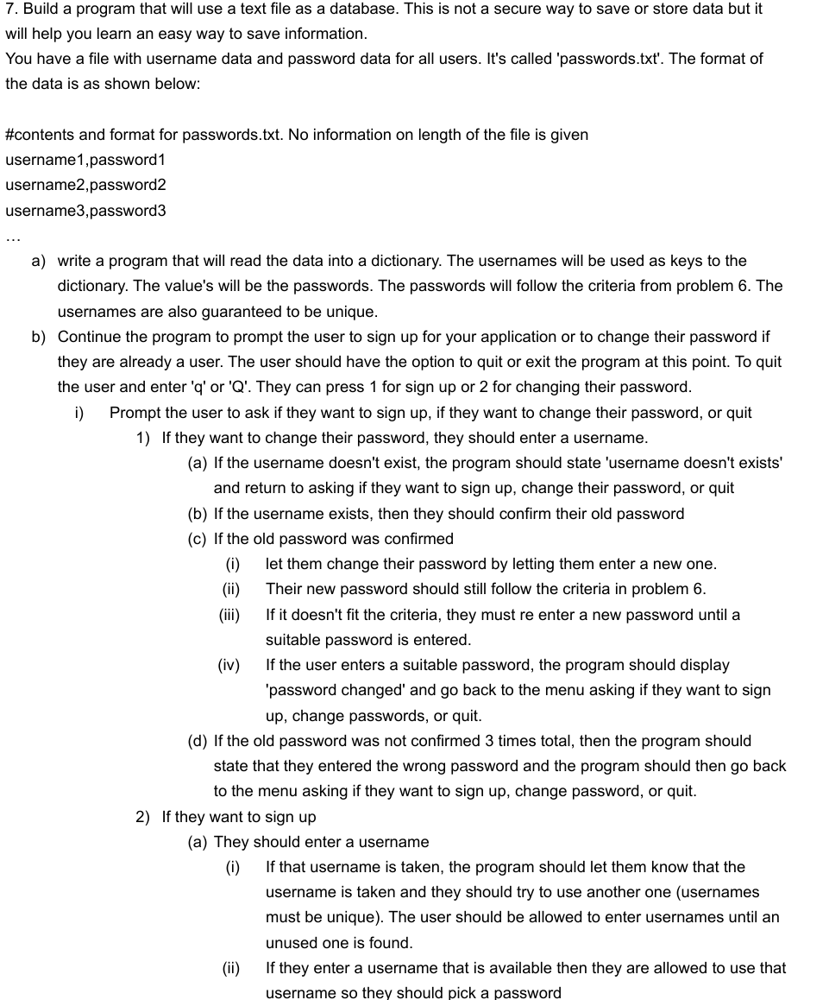
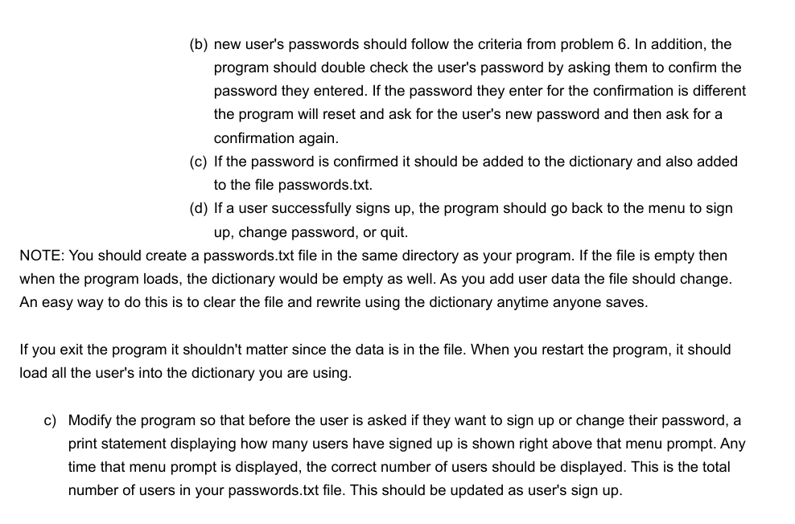

<h2> Project Information </h2>
In this project, I had to write a Python program that stores usernames and passwords. There were several rules to this project. You couldn't enter the same username and password. Password must contain at least 2 uppercase letters, 2 numbers, 8 characters, and must not include special characters such as 'space', '=', '?', etc. 
<h2> My Contribution </h2>
This project was individual. I used a lot of if-else statements to iterate and check every individual string. I used the while loop to loop the entire program until the user tells to quit. 

<h2> My Experience </h2>
I'm not going to lie, I had fun doing this project. I mean It was very frustrating but it was still very satisfying to do when you get a part right. I did this during my first year and I never had coding experience prior. So, I was proud of myself I could even make this. Unfortunately, I was unable to fully complete it. I was able to store usernames but the password kept looping even when it satisfied its requirement. I almost forgot about this project, but I'll fix it eventually when I have to time. 

## Project Rules
 

## My Code
```ruby
username = []
password = []
u = username.append(input('Enter a Username: '))
p = password.append(input('Enter a Password: '))

print('Press 1 to sign up')
print('Press 2 to change password')
print('Press Q or q to quit')
option = input()
while True:
    if option == '1':
        print('Enter a username')
        user = input()
        if user in username:
            print('Username is already taken. Enter a new username')
        else:
            username.append(user)
            print('Enter new password')
            pas = input()
            count = 0
            if count == 3:
                break
            else:
                if pas not in password:
                    count += 1
                else:
                    if pas in password:
                        pas = input('Enter New Password: ')
                        ct = 0
                        if count == 3:
                            break
                        else:
                            if pas not in password:
                                ct += 1
                            else:
                                if pas in password:
                                    pas = input('Enter New Password: ')
                                    c = 0
                                    k = 0
                                    keepgoing = True
                                    while keepgoing:
                                        for char in pas:
                                            if char == ' ' and char == '    ' and char == '=' and char == '?':
                                                print('Invalid Password, Please Enter a new password.')
                                                pas = input('Enter New Password: ')
                                                keepgoing == False
                                            elif char.isupper():
                                                c += 1
                                            elif c <= 1:
                                                print('Invalid Password, Please Enter a new password.')
                                                pas = input('Enter New Password: ')
                                                keepgoing == False
                                            elif char.isdigit():
                                                k += 1
                                            elif k <= 1:
                                                print('Invalid Password, Please Enter a new password.')
                                                pas = input('Enter New Password: ')
                                                keepgoing == False
                                            elif len(pas) < 8:
                                                print('Invalid Password, Please Enter a new password.')
                                                pas = input('Enter New Password: ')
                                                keepgoing == False
                                            else:
                                                print('Please re-enter your password')
                                                pas1 = input()
                                                if pas == pas1:
                                                    print('The password you entered is valid')
                                                    password.append(pas)  
                                                    keepgoing == False
                                                else:
                                                    print('Password entered not the same. Please reenter your password')
                                                    pas1 = input()
            
        

    elif option == '2':
        print('Enter username')
        user = input()
        if user not in username:
            print("Username doesn't exist")
            print('Press 1 to sign up')
            print('Press 2 to change password')
            option = input()
        else:
            print('Confirm old password')
            pas = input('Enter a Paswword: ')
            count = 0
            if count == 3:
                break
            else:
                if pas not in password:
                    count += 1
                else:
                    if pas in password:
                        pas = input('Enter New Password: ')
                        c = 0
                        k = 0
                        keepgoing = True
                        while keepgoing:
                            for char in pas:
                                if char == ' ' and char == '    ' and char == '=' and char == '?':
                                    print('Invalid Password, Please Enter a new password.')
                                    pas = input('Enter New Password: ')
                                    keepgoing == False
                                elif char.isupper():
                                    c += 1
                                elif c <= 1:
                                    print('Invalid Password, Please Enter a new password.')
                                    pas = input('Enter New Password: ')
                                    keepgoing == False
                                elif char.isdigit():
                                    k += 1
                                elif k <= 1:
                                    print('Invalid Password, Please Enter a new password.')
                                    pas = input('Enter New Password: ')
                                    keepgoing == False
                                elif len(pas) < 8:
                                    print('Invalid Password, Please Enter a new password.')
                                    pas = input('Enter New Password: ')
                                    keepgoing == False
                                else:                                    
                                    print('The password you entered is valid') 
                                    password.append(pas) 
                                    keepgoing == False
            
    elif option == 'q' or 'Q':
        break

    else:
        print('Press 1 to sign up')
        print('Press 2 to change password')
        print('Press Q or q to quit')
        option = input()
        break
```


